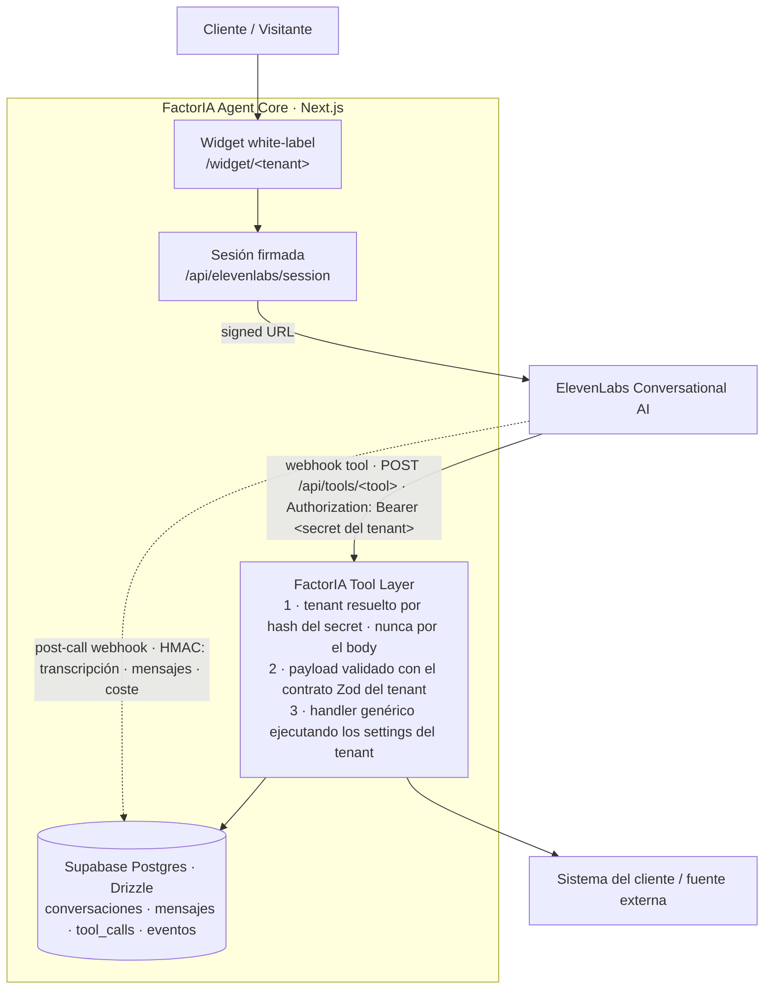

# FactorIA Agent Core

Núcleo multi-tenant de agentes de FactorIA. Un solo repositorio sirve a varios clientes:
cada **tenant** declara su identidad, su agente, sus tools y sus reglas de negocio en
`config/tenants/<id>.json`, y el core se encarga del resto.



## Stack

- Next.js 16 (App Router) + React 19 + Tailwind v4 + Zod
- `@elevenlabs/react` (widget) + `@elevenlabs/elevenlabs-js` (provisioning)
- Supabase Postgres + Drizzle ORM (persistencia operacional)
- Vitest (tests del core y de la Tool Layer)

## Estructura

```
config/tenants/                # FUENTE DE verdad por tenant (Zod-validada)
├─ mesa-y-cia.json            #   restaurante: reserve_table + check_weather
├─ vitea.json                 #   retail: check_stock
└─ _template.json             #   plantilla para crear tenants
lib/
├─ tenants/model.ts           #   modelo único de tenant (lo alimentan CLI y futuro panel)
├─ tenants/store.ts           #   carga/valida configs
├─ tenants/resolver.ts        #   hash del secret → tenant (aislamiento)
├─ tools/                     #   FACTORIA TOOL LAYER
│  ├─ types.ts                #     ToolDefinition + Zod desde el inputSchema del tenant
│  ├─ reserve-table.ts        #     handler genérico (mesas desde settings)
│  ├─ check-stock.ts          #     handler genérico (catálogo desde settings)
│  ├─ check-weather.ts        #     handler genérico (fetch real a Open-Meteo)
│  ├─ index.ts                #     executeTool() + registro de handlers
│  └─ ai.ts                   #     registry para Vercel AI SDK (mismo contrato)
├─ db/                        #   schema, cliente y repositorio (Drizzle)
├─ provisioning/service.ts    #   validate / diff / provision (usado por la CLI y el panel)
└─ elevenlabs.ts              #   cliente + signed URL server-side
├─ ratelimit/                 #   RateLimiter (port) + adaptador Postgres
├─ ratelimit/limiter.ts       #     interfaz + reglas por endpoint
├─ ratelimit/postgres.ts      #     upsert atómico, fail-open, IP de x-forwarded-for
app/
├─ api/tools/[toolName]/      #   DISPATCHER: auth → tenant → Zod → handler → persist
├─ api/elevenlabs/session/    #   signed URL (exige ?tenant=; origen y cuota)
├─ api/telephony/outbound-call/  #  llamada saliente (auth por secret del tenant)
├─ api/messaging/whatsapp/outbound-message/  # mensaje saliente (plantilla por tenant)
├─ api/widget/config/         #   config pública white-label por tenant (sin agentId)
├─ api/webhooks/elevenlabs/   #   post-call webhook (HMAC + idempotente)
└─ widget/[tenant]/           #   widget por tenant (branding del cliente)
scripts/
├─ setup.ts                   #   CLI de provisioning (idempotente)
└─ setup-new.ts               #   generador interactivo de un tenant
tests/                        #   Vitest: config, contrato Zod, aislamiento, handlers, rutas
docs/
├─ architecture-decisions.md  #   por qué se decidió cada cosa
├─ runbook-interno.md         #   operación diaria, límites y troubleshooting
└─ onboarding-checklist.md    #   entregable para el cliente
```

## Configuración

`cp .env.example .env` y completa:

| Variable | Uso |
|---|---|
| `DATABASE_URL` | Postgres de Supabase (transaction pooler, puerto 6543) |
| `ELEVENLABS_API_KEY` | Backend: agentes, tools, secrets, signed URLs |
| `ELEVENLABS_WEBHOOK_SECRET` | Verificación HMAC del webhook post-call |
| `FACTORIA_TENANT_<X>_SECRET` | Secret Bearer de cada tenant (**lo genera el provisioning**) |
| `NEXT_PUBLIC_FACTORIA_BASE_URL` | URL pública; es la que se apunta en las webhook tools |

Aplica la migración (una sola vez):

```bash
npm run db:migrate
```

## Crear y provisionar un tenant nuevo

```bash
# 1. Genera el config (interactivo) en config/tenants/<id>.json
npm run setup:new

# 1'. O no interactivo, con flags (útil en CI y para tests)
npm run setup:new -- --id casa-lorena --name "Casa Lorena" \
  --tools reserve_table,check_weather --currency cop \
  --tagline "Un hogar con historia" --color "#B45309" --icon "🏡"

# 2. Valida (Zod del modelo + handlers existentes; no toca nada)
npm run setup -- --tenant <id> --validate

# 3. Compara ElevenLabs vs config (no ejecuta cambios)
npm run setup -- --tenant <id> --diff

# 4. Provisiona: secret → webhook tools → agente → estado en DB (idempotente)
npm run setup -- --tenant <id>

# 5. Guarda el secret impreso en .env (o en Vercel → Environment Variables) y reinicia
```

El provisioning **imprime el secret una sola vez**: queda en el secret store del
workspace de ElevenLabs (como selector, nunca en el body de la tool) y su hash SHA-256
en la tabla `tenants`. Los secretos no se versionan.

Flags útiles: `--dry-run` (plan sin llamar a la API), `--force-update` (re-aplica
tools y prompt del agente), `--rotate-secret` (rota el secret del tenant),
`--list-clients`.

## Probar una tool por línea

```bash
curl -X POST $NEXT_PUBLIC_FACTORIA_BASE_URL/api/tools/reserve_table \
  -H "Authorization: Bearer $FACTORIA_TENANT_MESA_SECRET" \
  -H "Content-Type: application/json" \
  -d '{"date":"2026-10-05","party_size":4}'
```

Con el secret de otro tenant la misma tool responde `404` (ese tenant no la tiene) y
con un secret inválido responde `401`: el aislamiento se verifica en la línea de
comandos.

## Scripts

| Comando | Qué hace |
|---|---|
| `npm run dev` | servidor de desarrollo |
| `npm run build` | build de producción |
| `npm run typecheck` | tipos (`tsc --noEmit`) |
| `npm test` | suite Vitest |
| `npm run setup -- --help` | CLI de provisioning |
| `npm run setup:new` | genera `config/tenants/<id>.json` (interactivo o con flags) |
| `npm run db:generate` / `db:migrate` / `db:studio` | Drizzle |

`npm run typecheck && npm test && npm run build` es exactamente lo que corre
`.github/workflows/ci.yml` en cada push a `main` y en cada PR.

## Ver el widget

- `/widget/mesa-y-cia`, `/widget/vitea` → widget white-label del cliente.
- `/widget` → índice de tenants. Solo en desarrollo: en producción responde `404`.
- `/api/widget/config?tenant=<id>` → config pública para embeber (branding, primer
  mensaje y nombres/descripciones de tools). Nunca incluye secretos, el `agentId` ni las
  reglas de negocio, y sin `tenant` en producción responde `403`.

## Tenants incluidos

| Tenant | Vertical | Tools | Fuente de datos |
|---|---|---|---|
| `mesa-y-cia` | restaurante | `reserve_table`, `check_weather` | mesas desde `settings`; clima real de Open-Meteo |
| `vitea` | retail moda | `check_stock` | catálogo desde `settings` (precios, tallas, stock) |

## Notas y límites actuales

- Los datos de negocio de los tenants de ejemplo viven en el config (`settings`).
  Con un cliente real, `settings` se puebla desde su API: el handler no cambia.
- Redis y Langfuse están **diseñados pero no implementados**. El rate limiting que sí
  existe usa Postgres detrás de la interfaz `RateLimiter`, así que migrarlo a Redis es
  cambiar un adaptador, no las rutas. Ver `docs/architecture-decisions.md`.
- WhatsApp y telefonía requieren credenciales del cliente (número, WABA y plantillas
  aprobadas). Los dos endpoints outbound existen y devuelven `503` con el motivo exacto
  mientras el tenant no declare su número: es el último paso de la ruta, no un fallo.
  El estado por canal está en `docs/runbook-interno.md`.
- El widget se entrega como página por tenant; para embeber en el sitio del cliente
  basta un `iframe` a `/widget/<id>` o consumir `/api/widget/config`.
- No hay agente "por defecto" global ni modo demo: el agente de cada widget se resuelve
  en DB a partir del tenant. Si un tenant no está provisionado, el widget lo dice con
  los pasos exactos para provisionarlo.

Para operar y diagnosticar en el día a día, ver `docs/runbook-interno.md`.
